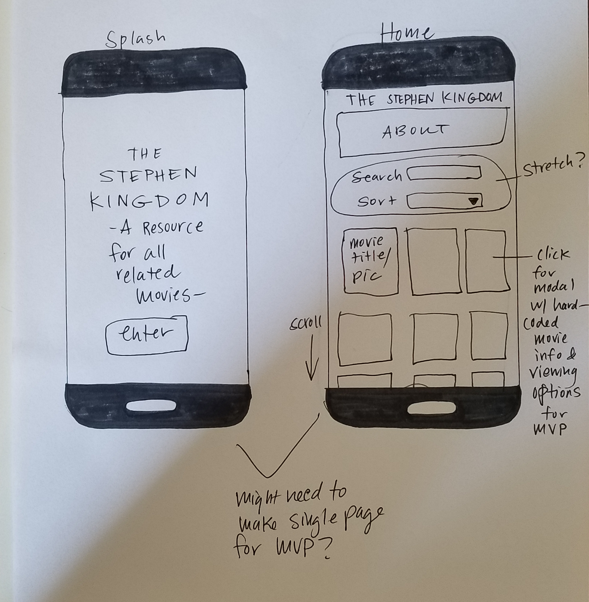

#  The Stephen Kingdom - Capstone project planning

#### By Megan Schulte 7-19-2019

## Description

  This mobile app will be a database for Stephen King related movies. It will provide users with information specific to how the movies relate to Stephen King, be it writing, directing, or just being based off his literature. It will also provide the user with information on where the movies can be viewed online. Because I will be learning how to build a React Native app for the first time and would also like to incorporate some accessibility functions into the app, the content structure will be kept somewhat simple for MVP.

## Setup/Installation Requirements
* Directions to view mobile app via Appetize.io to be provided at a later date.

## Component Tree/Project Planning

 ## Known Bugs

  No known bugs

  ## Support and contact details

  Create a pull request on GitHub.

  ## Technologies Used

  * React Native
  * React
  * Expo
  * Appetize.io
  * JSX
  * Material-for React Native

  ### License

  GPL, keep information free.

  Copyright (c) 2019 Megan Schulte
